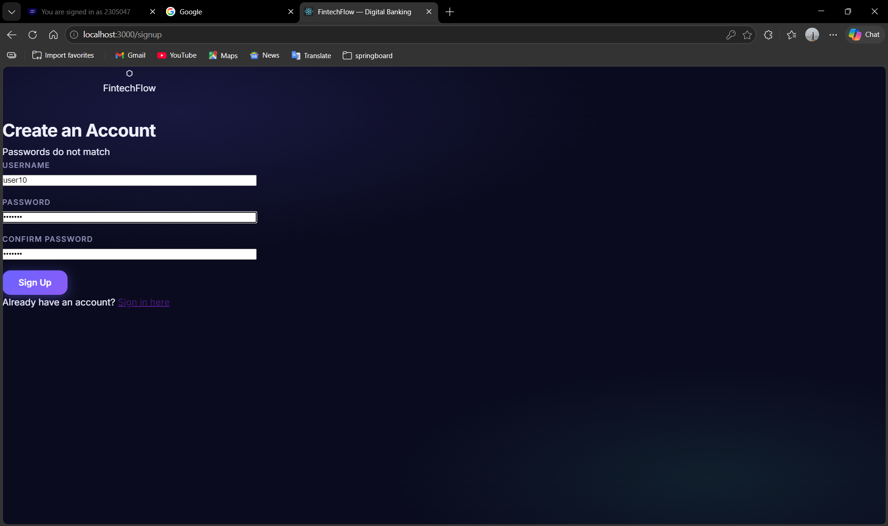
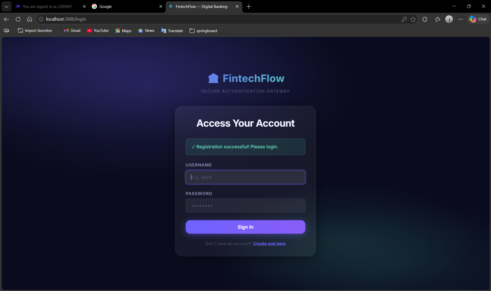
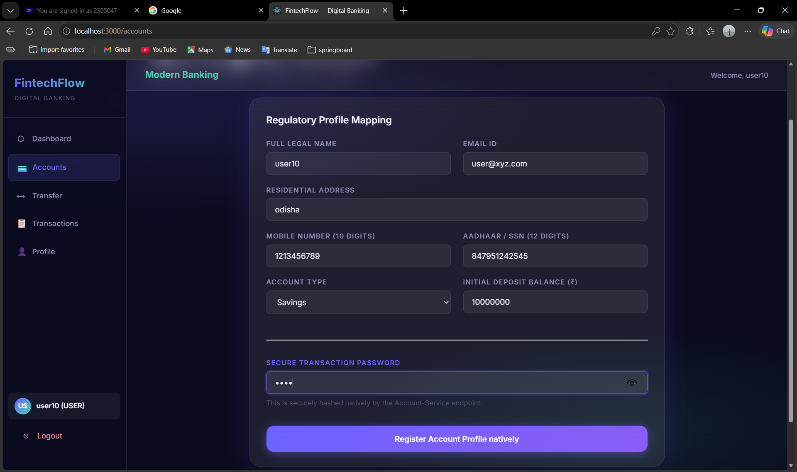
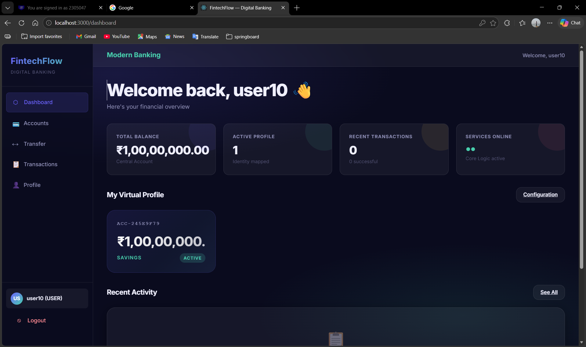
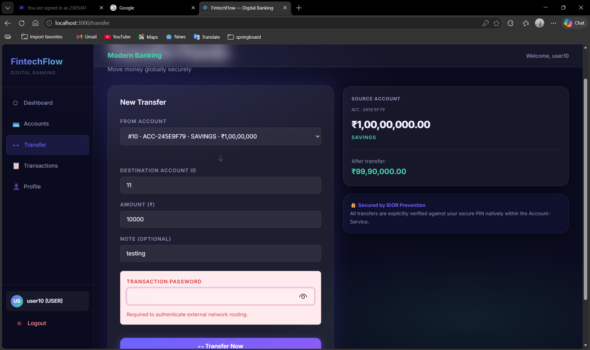
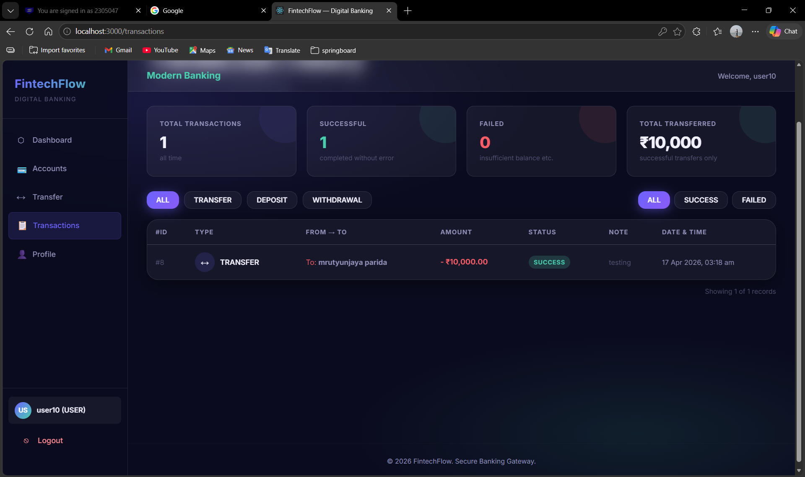

# 🏦 FinTech Flow — Wallet & Transaction Platform

A full-stack, **microservices-based** financial application that simulates a secure digital wallet system. Users can register, manage wallet balances, and perform peer-to-peer fund transfers with a complete transaction history. The platform is fully **Dockerized** for one-command startup.

---

## 🧩 System Architecture

```
User → Frontend (React + Vite) — Port 80
            ↓
   Account Service (8081)  ↔  Transaction Service (8082)
            ↓                          ↓
     PostgreSQL (account_db)   PostgreSQL (transaction_db)
```

> All services communicate inside a shared Docker network. The Transaction Service calls the Account Service via `http://account-service:8081` for balance validation and JWT propagation.

---

## 🏗️ Architecture Overview

The system is designed using a **microservices architecture**, ensuring separation of concerns, scalability, and maintainability.

### 🔹 Core Services

**Account Service** (`Account-Service/account-service`) — Port `8081`
- User registration and JWT-based authentication
- Wallet balance management
- Exposes REST APIs consumed by the Transaction Service

**Transaction Service** (`Transaction-Service/transaction-service`) — Port `8082`
- Peer-to-peer fund transfers
- Daily transaction limit enforcement (`DailyLimitExceededException`)
- Cross-service JWT token delegation to Account Service
- Full transaction history (sent + received)

**Frontend** (`fintech-frontend`) — Port `80` (served via Nginx in Docker)
- React 18 + Vite SPA
- JWT stored in localStorage; Axios interceptors attach Bearer token
- Nginx config handles React Router client-side routing

---

## 🛠️ Tech Stack

### Backend
| Technology | Purpose |
|---|---|
| Java 21 | Core language |
| Spring Boot 3 | Web, Data JPA, Security |
| Spring Security + JWT | Stateless authentication |
| PostgreSQL 15 | Persistent database |
| Lombok | Boilerplate reduction |
| Maven (mvnw) | Build tool |

### Frontend
| Technology | Purpose |
|---|---|
| React 18 | UI library |
| Vite 5 | Dev server & bundler |
| Axios | HTTP client |
| React Router DOM v6 | Client-side routing |

### Infrastructure
| Technology | Purpose |
|---|---|
| Docker | Containerization |
| Docker Compose | Multi-service orchestration |
| Nginx | Frontend static file server |
| PostgreSQL (Docker) | Shared DB container |

---

## ✨ Key Features

- ✅ Secure JWT authentication (stateless)
- ✅ Peer-to-peer fund transfer with balance validation
- ✅ Daily transaction limit with custom exception handling
- ✅ Transaction history — both sent and received
- ✅ Microservices architecture with REST inter-service communication
- ✅ IDOR prevention — users can only access their own data
- ✅ Fully Dockerized — single `docker-compose up` to run everything
- ✅ Nginx reverse-proxy for production-ready frontend serving

---

## 📁 Project Structure

```
mini_project/
├── Account-Service/
│   └── account-service/
│       ├── src/
│       ├── Dockerfile
│       ├── pom.xml
│       └── mvnw
├── Transaction-Service/
│   └── transaction-service/
│       ├── src/
│       ├── Dockerfile
│       └── pom.xml
├── fintech-frontend/
│   ├── src/
│   ├── Dockerfile
│   ├── nginx.conf
│   └── package.json
├── screenshots/
├── init-dbs.sql
├── docker-compose.yml
└── README.md
```

---

## 🐳 Running with Docker (Recommended)

> **Prerequisites:** Docker Desktop installed and running.

```bash
# Clone the repo
git clone https://github.com/<your-username>/<your-repo>.git
cd <your-repo>

# Build images and start all services
docker-compose up --build
```

| Service | URL |
|---|---|
| Frontend | http://localhost |
| Account Service API | http://localhost:8081 |
| Transaction Service API | http://localhost:8082 |

To stop:
```bash
docker-compose down
```

To stop and remove database volumes:
```bash
docker-compose down -v
```

---

## ⚙️ Running Manually (Without Docker)

### Prerequisites

- Java 21+
- Node.js 18+
- PostgreSQL 15 (running locally)
- Maven (or use the included `mvnw` wrapper)

### 1. Database Setup

```sql
CREATE DATABASE account_db;
CREATE DATABASE transaction_db;
```

### 2. Start Account Service

```bash
cd Account-Service/account-service
./mvnw spring-boot:run
```

### 3. Start Transaction Service

```bash
cd Transaction-Service/transaction-service
./mvnw spring-boot:run
```

### 4. Start Frontend

```bash
cd fintech-frontend
npm install
npm run dev
```

### ⚠️ Recommended Run Order

1. PostgreSQL
2. Account Service
3. Transaction Service
4. Frontend

---

## 📡 API Endpoints

### Account Service (`localhost:8081`)

| Method | Endpoint | Description |
|---|---|---|
| POST | `/api/auth/register` | Register a new user |
| POST | `/api/auth/login` | Authenticate and receive JWT |
| GET | `/api/account/balance` | Get wallet balance (JWT required) |

### Transaction Service (`localhost:8082`)

| Method | Endpoint | Description |
|---|---|---|
| POST | `/api/transactions/transfer` | Transfer funds to another user |
| GET | `/api/transactions/history` | Get sent + received transaction history |

---

## 🔗 Service Communication

The **Transaction Service** communicates with the **Account Service** via REST:

- JWT tokens are forwarded via the `Authorization` header
- Configured via environment variable: `ACCOUNT_SERVICE_URL=http://account-service:8081`
- Balance deduction and credit happen in a coordinated flow with proper error handling

---

## 📷 Screenshots

### Signup


### Login


### KYC Details


### Dashboard


### Transfer Funds


### Transaction History


---

## 🚀 Future Improvements

- API Gateway (Spring Cloud Gateway)
- Service Discovery (Eureka / Consul)
- Cloud deployment (AWS ECS / Render)
- Role-based access control (Admin panel)
- Email/OTP-based 2FA

---

## 📌 Summary

This project demonstrates a real-world implementation of microservices architecture with secure JWT authentication, containerized deployment, and peer-to-peer transaction management — reflecting backend design principles applicable to production financial systems.
